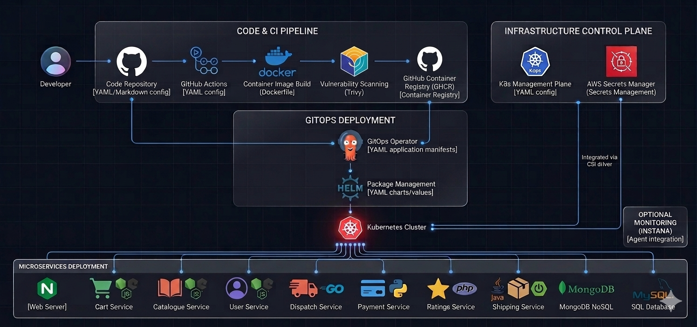
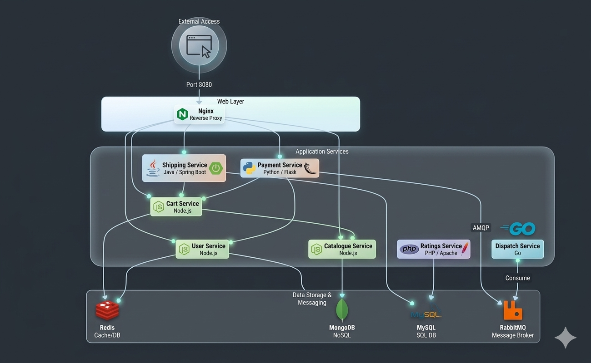
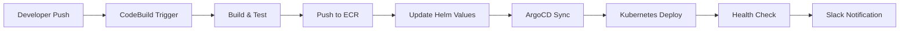

# 🛍️ ShopStack Microservices Project

A comprehensive e-commerce microservices architecture built with containerized services, featuring modern CI/CD pipelines, monitoring, and observability.




## 📋 Table of Contents

- [🏗️ Architecture Overview](#-architecture-overview)
- [🚀 Services](#-services)
- [🔧 Development Setup](#-development-setup)
- [🐳 Docker & Local Development](#-docker--local-development)
- [🚀 CI/CD Pipeline](#-cicd-pipeline)
- [☸️ Kubernetes Deployment](#️-kubernetes-deployment)
- [📊 Monitoring & Observability](#-monitoring--observability)
- [🔒 Security](#-security)
- [📁 Project Structure](#-project-structure)

## 🏗️ Architecture Overview

ShopStack implements a microservices-based e-commerce platform with the following core components:

### 🎯 Business Services
- **Web Frontend** - Nginx-based UI gateway with reverse proxy
- **User Service** - User authentication and management (MongoDB + Redis)
- **Catalog Service** - Product catalog management (MongoDB)
- **Cart Service** - Shopping cart functionality (Redis)
- **Payment Service** - Payment processing with RabbitMQ messaging
- **Shipping Service** - Order fulfillment and shipping (MySQL)
- **Ratings Service** - Product rating and review system (MySQL)
- **Dispatch Service** - Order processing and dispatch via RabbitMQ

### 🛠️ Infrastructure Services
- **MongoDB** - Primary database for User, Catalog, and Cart services
- **Redis** - Caching layer for User and Cart services
- **MySQL** - Database for Shipping and Ratings services
- **RabbitMQ** - Message queuing for Payment and Dispatch services

### 📊 Observability Stack
- **OpenTelemetry** - Distributed tracing and metrics
- **Elasticsearch** - Centralized logging and search
- **Kibana** - Log visualization and analysis
- **Prometheus** - Metrics collection and alerting
- **Grafana** - Metrics visualization (disabled in favor of Kibana)
- **Fluentd/Fluentbit** - Log aggregation and forwarding

### 🚀 CI/CD & Deployment
- **AWS CodeBuild** - Automated build and deployment
- **Amazon ECR** - Container registry
- **ArgoCD** - GitOps continuous deployment
- **Slack Integration** - Build and deployment notifications

## 🚀 Services

### 🌐 Web Frontend
- **Technology:** Nginx + React SPA
- **Port:** 8080 (exposed)
- **Features:** Reverse proxy, static asset serving, service routing
- **Health Check:** `/` endpoint
- **Dependencies:** catalogue, user, shipping, payment
- **Monitoring:** Instana APM integration

### 👤 User Service
- **Technology:** Node.js/Express
- **Database:** MongoDB + Redis
- **Features:** JWT authentication, user management, profile management
- **Health Check:** `/health` endpoint
- **Dependencies:** mongodb, redis

### 📚 Catalog Service
- **Technology:** Node.js/Express
- **Database:** MongoDB
- **Features:** Product catalog, search, inventory management
- **Health Check:** `/health` endpoint
- **Dependencies:** mongodb

### 🛒 Cart Service
- **Technology:** Node.js/Express
- **Database:** Redis (session storage)
- **Features:** Shopping cart, session management, cart persistence
- **Health Check:** `/health` endpoint
- **Dependencies:** redis

### 💳 Payment Service
- **Technology:** Node.js/Express
- **Message Queue:** RabbitMQ
- **Features:** Payment processing, multiple gateway support (WorldPay)
- **Health Check:** `/health` endpoint
- **Dependencies:** rabbitmq
- **Security:** PCI compliance considerations

### 📦 Shipping Service
- **Technology:** Node.js/Express
- **Database:** MySQL
- **Features:** Order fulfillment, shipping calculation, tracking
- **Health Check:** `/health` endpoint
- **Dependencies:** mysql

### ⭐ Ratings Service
- **Technology:** Node.js/Express
- **Database:** MySQL
- **Features:** Product ratings, reviews, averaging system
- **Health Check:** `/_health` endpoint (different path)
- **Environment:** Production mode enabled
- **Dependencies:** mysql

### 🚚 Dispatch Service
- **Technology:** Node.js/Express
- **Message Queue:** RabbitMQ
- **Features:** Order processing, event dispatch, workflow orchestration
- **Dependencies:** rabbitmq
- **Note:** No health check endpoint

## 🔧 Development Setup

### Prerequisites
- Docker & Docker Compose
- Node.js 16+ (for local development)
- AWS CLI (for CI/CD)
- Git (for version control)

### Local Development
```bash
# Clone the repository
git clone https://github.com/Uj5Ghare/Kops-Microservices-Project.git
cd Kops-Microservices-Project

# Copy environment file
cp .env.example .env

# Edit environment variables
nano .env

# Start all services
docker-compose up -d

# View logs
docker-compose logs -f [service-name]

# Stop services
docker-compose down
```

### Environment Variables
```bash
# Required for Docker Compose
REPO=shopstack                    # Docker repository name
TAG=1.0.0                        # Docker image tag
INSTANA_AGENT_KEY=your-key       # Instana monitoring key

# Required for CI/CD
AWS_ACCOUNT_ID=your-aws-account-id
PROJECT=shopstack
TARGET_BRANCH=k8s/staging  # or k8s/preprod
```

## 🐳 Docker & Local Development

### Docker Compose Services
- **MongoDB:** Custom image built from `mongo/` directory
- **Redis:** Official Redis 6.2-alpine image
- **RabbitMQ:** Official RabbitMQ 3.8-management-alpine image
- **MySQL:** Custom image built from `mysql/` directory with NET_ADMIN capabilities
- **Microservices:** Built from individual service directories with standardized health checks
- **Network:** Shared `shopstack` network for inter-service communication

### Health Checks
All services implement standardized health checks using:
```bash
curl -H "X-INSTANA-SYNTHETIC: 1" -f http://localhost:8080/health
```
**Exceptions:**
- **Web Frontend:** Uses `/` endpoint instead of `/health`
- **Ratings Service:** Uses `/_health` endpoint
- **Dispatch Service:** No health check endpoint

### Service Dependencies
```
Web → Catalogue, User, Shipping, Payment
User → MongoDB, Redis
Catalogue → MongoDB
Cart → Redis
Payment → RabbitMQ
Shipping → MySQL
Ratings → MySQL
Dispatch → Rabbitmq
```

## 🚀 CI/CD Pipeline

### AWS CodeBuild Configuration
- **Build Spec:** `buildspec.yml`
- **Triggers:** Git push to `k8s/staging` and `k8s/preprod`
- **Environments:** Staging and Production
- **Registry:** Amazon ECR

### Build Process
1. **Pre-build:** ECR login and change detection
2. **Build:** Docker image creation with multi-platform support
3. **Post-build:** Git operations and Slack notifications
4. **Deploy:** Helm chart updates and ArgoCD sync

### Automated Versioning
- **Semantic Versioning:** Automatic patch version increment
- **Tag Strategy:** `MAJOR.MINOR.PATCH` format
- **Rollback Support:** Previous version tracking

### Slack Integration
- **Build Notifications:** Start and completion alerts
- **Deployment Notifications:** Environment-specific channels
- **Failure Alerts:** Immediate error reporting

## ☸️ Kubernetes Deployment

### 🌳 Branching Strategy & GitOps Workflow

The ShopStack project uses a **GitOps-based branching strategy** with environment-specific branches:

```
📁 Repository Structure:
├── k8s/staging     → Staging environment deployments
├── k8s/preprod     → Production environment deployments  
└── main/develop    → Development (feature branches)
```

### 🔄 Deployment Architecture

#### **Git Repository Structure**
```
Kops-Microservices-Project/
├── 📁 argocd/           # ArgoCD Application manifests
│   ├── cart.yaml        # Cart service ArgoCD app
│   ├── catalogue.yaml   # Catalog service ArgoCD app
│   ├── user.yaml        # User service ArgoCD app
│   └── ...              # Other services
├── 📁 helm/             # Helm charts for each service
│   ├── cart/            # Cart service Helm chart
│   │   ├── Chart.yaml   # Chart metadata
│   │   ├── values.yaml  # Default configuration
│   │   └── templates/   # Kubernetes templates
│   ├── catalogue/       # Other service charts
│   └── ...
├── 📁 valuefiles/       # Environment-specific Helm values
│   ├── argocd-values.yaml    # ArgoCD configuration
│   ├── prometheus-values.yaml # Monitoring config
│   └── ...                  # Other infrastructure configs
└── 📁 [service-dirs]/  # Source code and Dockerfiles
```

#### **ArgoCD Application Structure**

Each microservice has a dedicated ArgoCD Application manifest:

```yaml
# argocd/cart.yaml
apiVersion: argoproj.io/v1alpha1
kind: Application
metadata:
  name: cart
  namespace: argocd
spec:
  destination:
    namespace: shopstack    # Target Kubernetes namespace
    server: https://kubernetes.default.svc
  project: default
  source:
    helm:
      parameters:           # Helm value overrides
        - name: hpa.enabled
          value: "true"
        - name: defaults.namespace.name
          value: "shopstack"
      valueFiles:
        - values.yaml        # Helm values file
    path: helm/cart          # Helm chart path in repo
    repoURL: https://github.com/Uj5Ghare/Kops-Microservices-Project.git
    targetRevision: k8s/staging  # 🎯 KEY: Branch to track
  syncPolicy:
    automated:
      prune: true           # Auto-remove resources
      selfHeal: true        # Auto-fix drift
```

#### **Helm Chart Structure**

Each service has a standardized Helm chart:

```yaml
# helm/cart/values.yaml
defaults:
  namespace:
    name: shopstack
deploy:
  replicaCount: 1
  image:
    repository: ghcr.io/shopstack/shopstack-cart
    tag: latest              # 🔄 Updated by CI/CD
  tolerations:
    key: app
    operator: Equal
    value: shopstack        # 🎯 Standardized tolerations
  env:
    - name: REDIS_HOST
      value: "redis"
    - name: CATALOGUE_HOST
      value: "catalogue"

service:
  type: ClusterIP
  ports:
    http:
      port: 8080
      targetPort: 8080

hpa:
  enabled: true
  maxReplicas: 3
  minReplicas: 1
```

### 🚀 Deployment Workflow with k8s/staging

#### **Step 1: Code Changes & CI/CD**
```bash
# Developer makes changes
git checkout -b feature/new-feature
# ... make changes ...
git commit -m "Add new feature"
git push origin feature/new-feature

# CI/CD Pipeline (buildspec.yml) triggers:
# 1. Detects changed service folder
# 2. Builds Docker image
# 3. Pushes to ECR with new tag
# 4. Updates Helm values with new image tag
# 5. Pushes to k8s/staging branch
```

#### **Step 2: ArgoCD Automatic Deployment**
```bash
# ArgoCD monitors k8s/staging branch
# Detects changes in helm/[service]/values.yaml
# Automatically deploys to staging environment
```

#### **Step 3: Environment Promotion**
```bash
# After staging validation:
git checkout k8s/preprod
git merge k8s/staging
git push origin k8s/preprod

# ArgoCD deploys to production
```

### 🎯 Key Components

#### **1. ArgoCD Applications** (`argocd/`)
- **Purpose**: Define which services to deploy and how
- **Target**: `k8s/staging` or `k8s/preprod` branches
- **Namespace**: All services deploy to `shopstack` namespace
- **Sync Policy**: Automated with self-healing

#### **2. Helm Charts** (`helm/`)
- **Purpose**: Kubernetes resource templates for each service
- **Structure**: Standardized across all services
- **Configuration**: Environment-agnostic defaults
- **Templates**: Deployment, Service, HPA, Ingress, etc.

#### **3. Value Files** (`valuefiles/`)
- **Purpose**: Environment-specific configurations
- **Infrastructure**: Monitoring, logging, security tools
- **Tolerations**: Standardized `app=shopstack` pattern
- **Integration**: ArgoCD, Prometheus, Elasticsearch, etc.

### 🔄 Complete Deployment Flow

```mermaid
graph LR
    A[Developer Push] --> B[CI/CD Pipeline]
    B --> C[Build Docker Image]
    C --> D[Push to ECR]
    D --> E[Update Helm Values]
    E --> F[Push to k8s/staging]
    F --> G[ArgoCD Detects Changes]
    G --> H[Deploy to Staging]
    H --> I[Testing & Validation]
    I --> J[Manual Approval]
    J --> K[Merge to k8s/preprod]
    K --> L[ArgoCD Deploy to Production]
```



### 📊 Service Dependencies

```yaml
# ArgoCD Application Dependencies:
web → catalogue, user, shipping, payment, ratings
user → mongodb, redis
catalogue → mongodb
cart → redis
payment → rabbitmq
shipping → mysql
ratings → mysql
dispatch → rabbitmq
```

### 🎛️ Configuration Management

#### **Environment Variables** (per service):
```yaml
# Cart Service
REDIS_HOST: redis
CATALOGUE_HOST: catalogue
INSTANA_AUTO_PROFILE: true

# User Service  
REDIS_HOST: redis
MONGO_URL: mongodb://mongodb:27017/users
```

#### **Standardized Settings** (all services):
```yaml
tolerations:
  key: app
  operator: Equal  
  value: shopstack

affinity:
  nodeAffinity:
    key: app
    operator: In
    values: shopstack
```

### 🚀 Benefits of This Structure

1. **GitOps**: Everything is code-controlled and versioned
2. **Environment Isolation**: Separate branches for staging/production
3. **Automated Deployments**: ArgoCD handles deployment automatically
4. **Standardization**: Consistent structure across all services
5. **Scalability**: Easy to add new services following the same pattern
6. **Rollback**: Simple branch-based rollback capability
7. **Observability**: Integrated monitoring and logging stack

### Cluster Management
- **Tool:** Kubernetes Operations (kops)
- **Environments:** 
  - Staging: `k8s/staging` branch
  - Production: `k8s/preprod` branch

### Node Tolerations
All services use standardized tolerations:
```yaml
tolerations:
  key: app
  operator: Equal
  value: shopstack
```

### ArgoCD Configuration
- **GitOps:** Automated deployments from Git
- **Helm Charts:** Dynamic value updates
- **Sync Strategy:** Automated with manual overrides
- **Health Monitoring:** Application and cluster health

### Namespace Strategy
- **Unified Namespace:** `shopstack` for all services
- **Isolation:** Environment-specific deployments
- **Resource Management:** Centralized resource quotas

## 📊 Monitoring & Observability

### Logging Stack
- **Fluentd/Fluentbit:** Log collection and forwarding
- **Elasticsearch:** Centralized log storage and indexing
- **Kibana:** Log visualization and analysis dashboard
- **CloudWatch:** AWS log aggregation backup

### Metrics & Alerting
- **Prometheus:** Metrics collection from all services
- **AlertManager:** Alert routing and management
- **Custom Alerts:** Application-specific monitoring rules
- **Slack Integration:** Real-time alert notifications

### Distributed Tracing
- **OpenTelemetry:** End-to-end request tracing
- **Service Mesh:** Inter-service communication monitoring
- **Performance Analysis:** Request latency and error tracking
- **Instana Integration:** APM and synthetic monitoring

### Health Monitoring
All services expose `/health` endpoints:
- **Response Format:** JSON with service status
- **Dependencies:** Database and external service checks
- **Automated Testing:** Synthetic transaction monitoring

## 🔒 Security

### Container Security
- **Base Images:** Official and trusted base images
- **Minimal Privileges:** Least-privilege container execution
- **Secret Management:** Kubernetes secrets and environment variables
- **Image Scanning:** Automated vulnerability scanning

### Network Security
- **Service Mesh:** Internal network isolation
- **TLS Encryption:** Inter-service communication
- **API Gateway:** Centralized access control
- **Rate Limiting:** DDoS protection and abuse prevention

### Data Protection
- **Encryption at Rest:** MongoDB and Redis encryption
- **Encryption in Transit:** TLS for all communications
- **PII Protection:** Personal data anonymization
- **Compliance:** GDPR and PCI DSS considerations

## 📁 Project Structure

```
Kops-Microservices-Project/
├── 📁 Service Directories
│   ├── web/           # Frontend application
│   ├── user/          # User management service
│   ├── catalogue/     # Product catalog service
│   ├── cart/          # Shopping cart service
│   ├── payment/       # Payment processing service
│   ├── shipping/      # Shipping fulfillment service
│   ├── ratings/       # Product rating service
│   ├── dispatch/       # Order dispatch service
│   ├── mongo/          # Database configuration
│   └── mysql/          # Database scripts
├── 📁 Infrastructure
│   ├── docker-compose.yaml    # Local development setup
│   ├── buildspec.yml        # CI/CD pipeline
│   └── arch.png           # Architecture diagram
├── 📁 Kubernetes
│   └── valuefiles/         # Helm value files
│       ├── argocd-values.yaml
│       ├── prometheus-values.yaml
│       ├── elasticsearch-values.yaml
│       └── [other service configs]
├── 📁 Configuration
│   ├── .env.example       # Environment template
│   └── .gitignore        # Git ignore rules
└── 📁 Documentation
    ├── README.md           # This file
    └── LICENSE            # Project license
```

### Service Directory Structure
Each service follows the standard structure:
```
[service]/
├── Dockerfile          # Container build definition
├── package.json        # Node.js dependencies
├── src/               # Application source code
├── helm/              # Kubernetes deployment charts
│   └── values.yaml    # Service configuration
└── tests/              # Unit and integration tests
```

## 🚀 Quick Start

### 1. Local Development
```bash
# Clone and setup
git clone https://github.com/Uj5Ghare/Kops-Microservices-Project.git
cd Kops-Microservices-Project
cp .env.example .env

# Edit environment variables with your values
nano .env

# Start all services
docker-compose up -d

# Access services
open http://localhost:8080  # Web frontend

# Check service health
curl http://localhost:8080/health  # Web service
curl http://localhost:8080/health  # Other services (via web proxy)
```

### 2. Service-Specific Development
```bash
# Build specific service
docker-compose build catalogue

# Start specific service with dependencies
docker-compose up -d mongodb catalogue

# View service logs
docker-compose logs -f catalogue

# Access service directly (if exposed)
curl http://localhost:8080/health  # Web service only
```

### 3. Kubernetes Deployment
```bash
# Deploy to staging
git checkout k8s/staging
git push origin k8s/staging

# Deploy to production
git checkout k8s/preprod
git push origin k8s/preprod
```

### 3. Monitoring Access
- **Kibana Dashboard:** `https://observability.ujwal5ghare.xyz`
- **Prometheus:** Available via cluster port forwarding
- **ArgoCD:** `https://argocd.ujwal5ghare.xyz`

## 🔄 CI/CD Workflow



## 🛠️ Troubleshooting

### Common Issues

#### Service Won't Start
```bash
# Check logs
docker-compose logs [service-name]

# Verify environment
docker-compose config

# Check port conflicts
netstat -tulpn | grep [port]
```

#### Build Failures
```bash
# Check build logs
aws codebuild batch-get-builds --project-name shopstack

# Verify ECR permissions
aws ecr get-authorization-token
```

#### Deployment Issues
```bash
# Check ArgoCD status
kubectl get applications -n argocd

# Verify tolerations
kubectl describe nodes
```

## 📚 Additional Resources

### Documentation
- [Service API Documentation](./docs/api/)
- [Deployment Guides](./docs/deployment/)
- [Monitoring Setup](./docs/monitoring/)

### Support
- **Issues:** [GitHub Issues](https://github.com/Uj5Ghare/Kops-Microservices-Project/issues)
- **Discussions:** [GitHub Discussions](https://github.com/Uj5Ghare/Kops-Microservices-Project/discussions)

---

## 📄 License

This project is licensed under the MIT License - see the [LICENSE](LICENSE) file for details.

## 🤝 Contributing

1. Fork the repository
2. Create a feature branch
3. Make your changes
4. Add tests if applicable
5. Submit a pull request

---

**Built with ❤️ for the ShopStack e-commerce platform**
